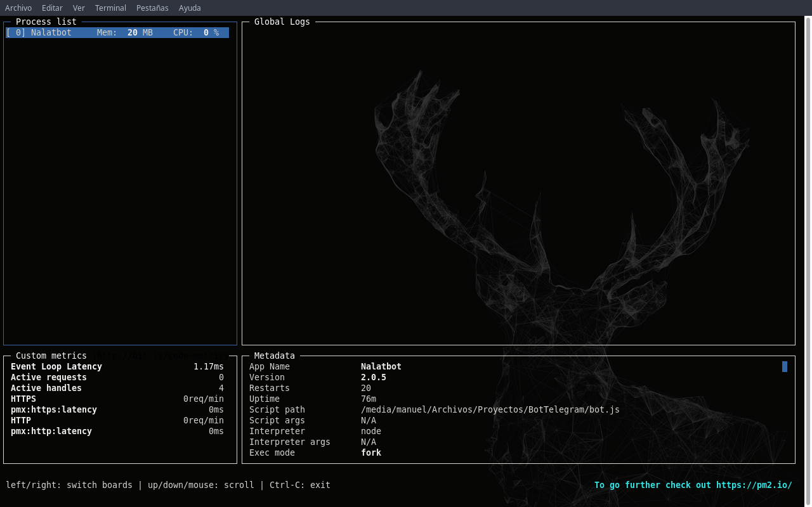

# BotTelegram

[](https://core.telegram.org/bots/api)
[](https://nodejs.org/en/)
[](https://github.com/yagop/node-telegram-bot-api)
[](https://twitter.com/MaEscalanteHe)
[](https://telegram.me/MaEscalanteHe)


## Instalación

Primero se necesita installar nodejs, debes ejecutar el siguiente comando en la terminal:

```bash
sudo apt-get install nodejs
```

Para instalar las dependencias que necesita el bot.js para conectarse a la API de Telegram debes ejecutar el siguente comando:

```bash
npm install --save node-telegram-bot-api
```

---
## Uso de PM2

PM2 es un gestor de procesos en producción para las aplicaciones Node.js que tiene un balanceador de carga incorporado. PM2 permite mantener siempre activas las aplicaciones y volver a cargarlas evitando los tiempos de inactividad, a la vez que facilita tareas comunes de administrador del sistema. PM2 también permite gestionar el registro de aplicaciones, la supervisión y la agrupación en clúster.

**Las principales características de pm2:**

* Capacidad de manejar un montón de apps. (Ver el estado de distintas apps)
* Capacidad de monitoreo de memoria y cps de nuestros procesos.
* Manejo de logs.
* Balanceo de carga.
* Iniciar tus aplicaciones una vez el servidores se inicia.
* Capacidad de “watch your code” si tu codigo cambia.

### Instalación de PM2

Para poder instalar pm2 necesitas tener previamente instaldo nodejs. Para instalar solo tenemos que ejecutar el siguiente comando en la terminal:

```bash
npm install -g pm2
```

### Comandos básicos 



* Para iniciar:

```bash
pm2 start bot.js
```

* Para reinicarlo:

```bash
pm2 restart bot.js
```
* Para detenerlo:

```bash
pm2 stop bot.js
```

* Para elminar el proceso:

```bash
pm2 delete bot.js
```

* Para ponerle un alias para manejarlo mejor:

```bash
pm2 start bot.js --name "alias"
```

* Para obtener una lista de procesos actuales:

```bash
pm2 list
```

* Para mostrar el monitor, el cual muestra información más detallada y actualizada en tiempo real:

```bash
pm2 monit
```

* Para mostrar el log:

```bash
pm2 log
```

### Generación del script de startup

Para configurar el script de startup del servidor se debe tener los procesos en marcha, arrancados mediante PM2, y ejecutar el siguiente comando:

```bash
pm2 startup
```

## Colaboladores

Manuel Escalante
Manuel Rodriguez
Javier Medina